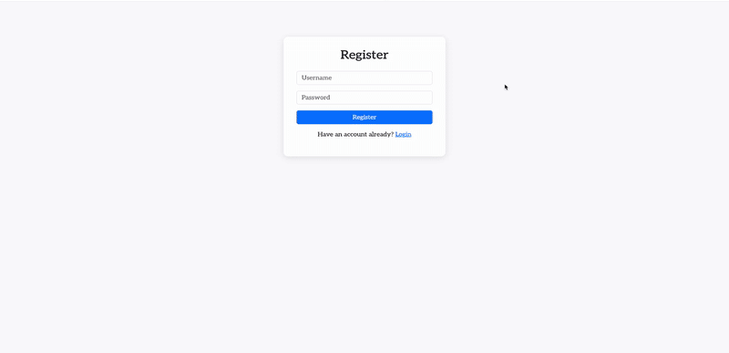

# Description
The Rock-Paper-Scissors Camera Game is an interactive application that utilizes a camera to allow users to play the classic game of rock-paper-scissors against a computer opponent. The application uses computer vision to recognize hand gestures representing rock, paper, or scissors, providing a fun and engaging way for users to play the game



# Team
* [Josh Lavroff](https://github.com/joshlavroff)
* [Andrew Jung](https://github.com/AndrewJung03)
* [Keith Dusling](https://github.com/kdusling56)
* [Krish Kothari](https://github.com/krish-nyu)

# User Stories
- As a user, I want to start the game by clicking a "Start" button so that I can begin playing rock-paper-scissors against the computer.
- As a user, I want the application to recognize my hand gestures for rock, paper, or scissors so that I can play the game without using a keyboard or mouse.
- As a user, I want to see real-time feedback on my gesture recognition so that I can confirm that my choice has been correctly identified before the round begins.
- As a user, I want the computer to randomly select its gesture (rock, paper, or scissors) so that I can compete against it in the game.
- As a user, I want to see the results of each round (win, lose, or draw) so that I can track my performance against the computer.
- As a user, I want to see my score and the computer's score displayed on the screen so that I can keep track of who is winning throughout the game.

# Instructions 

To launch the application, run the following command in your terminal from the project root:

```bash
docker-compose up --build

## 🔧 Environment Setup

Place the .env file in the root directory. .env was sent in the team's discord channel.